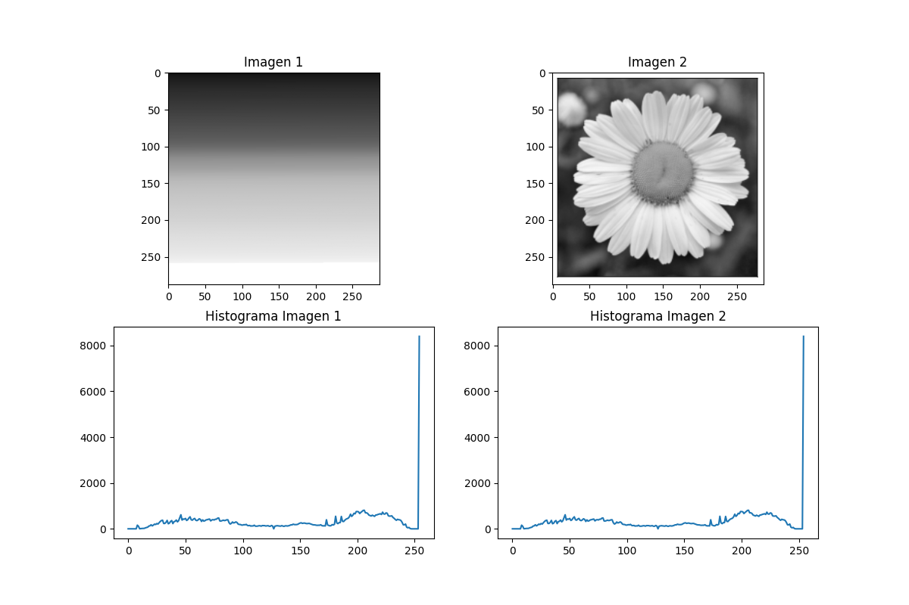
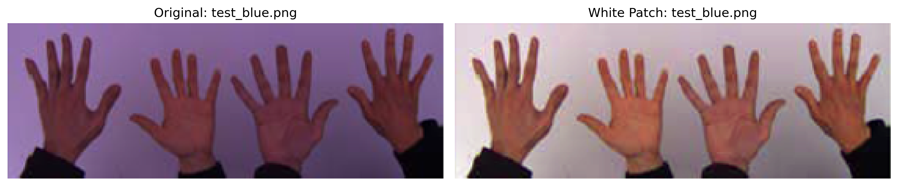
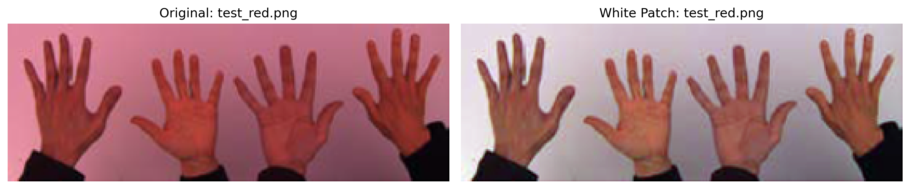
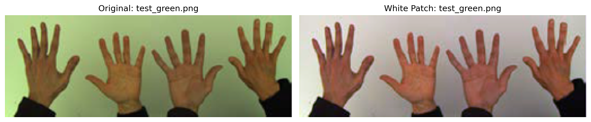
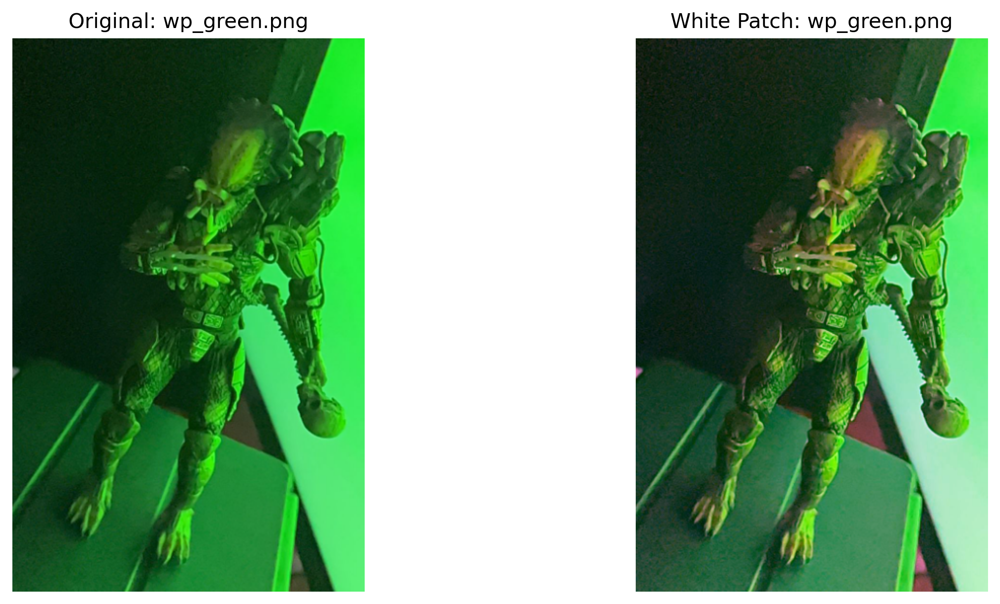
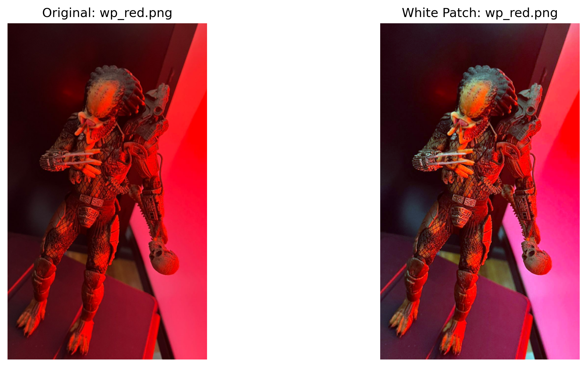
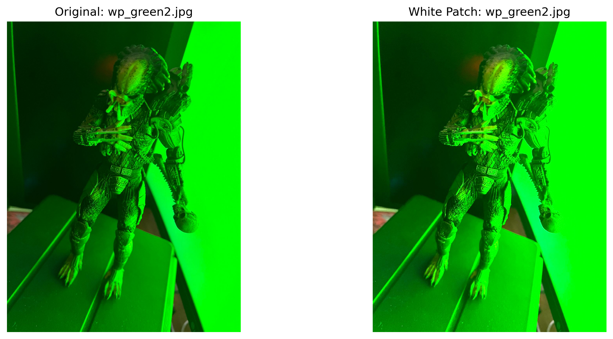
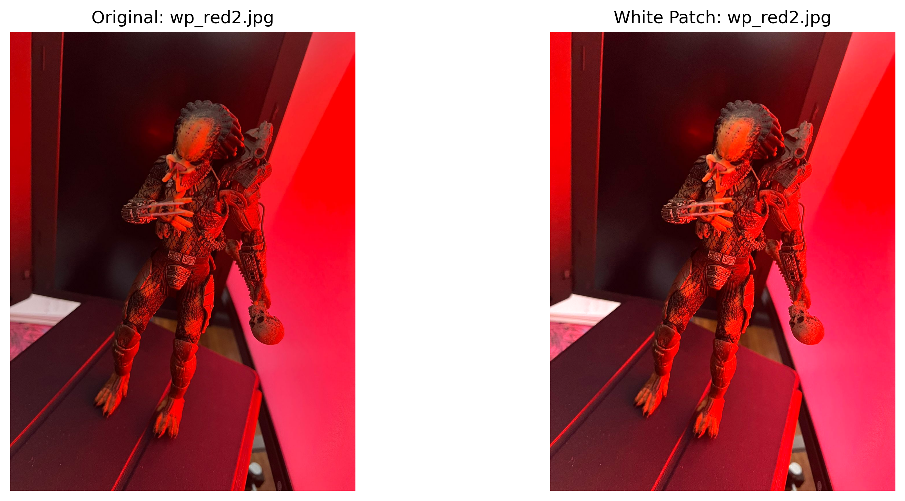
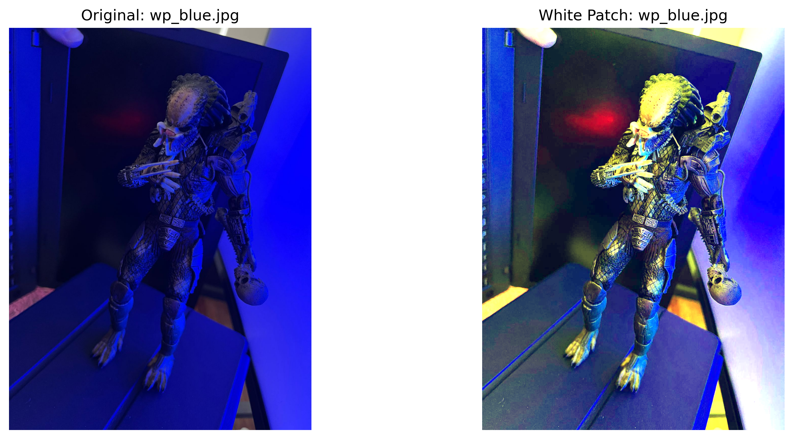

# Computer Vision - Maestría en Ciencias de la Computación

Este repositorio contiene los códigos y experimentos realizados para la materia de Visión por Computador de la Maestría en Ciencias de la Computación.

## Estructura del Proyecto

El proyecto está dividido en dos archivos principales, uno para cada punto del trabajo práctico:
- `tp1_1.py` - Algoritmo White Patch
- `tp1_2.py` - Análisis de histogramas

## Instalación y Ejecución

Para ejecutar los códigos, es necesario tener instalado Python 3.8 o superior y las librerías listadas en `requirements.txt`. Se recomienda usar un entorno virtual para instalar las dependencias:

```bash
python3 -m venv venv
source venv/bin/activate
pip install -r requirements.txt
```

Luego, para ejecutar cada punto, simplemente correr el archivo correspondiente:

```bash
python tp1_1.py
python tp1_2.py
```

## Análisis de Histogramas para Clasificación

Con respecto a la pregunta si es conveniente usar histogramas como features para clasificar una imagen, la respuesta es que **se puede usar**, pero hay que tener en cuenta que en un histograma **se pierde toda la información espacial** de la imagen. Es decir, se podrían tener dos imágenes con el mismo histograma pero con contenido completamente diferente, como se observa en la **Figura 1**.



*Figura 1: Dos imágenes completamente diferentes con histogramas idénticos*

**No lo recomendaría** para tareas de clasificación de imágenes, ya que hay otras técnicas que preservan mejor la información espacial como la operación de convolución con filtros. Estas pueden capturar características locales y patrones en la imagen, lo que es crucial para tareas de clasificación.

## Algoritmo White Patch - Implementaciones

### Primera Implementación: Algoritmo Simple

Se implementó un algoritmo simple que dio buenos resultados en las imágenes `test_*.jpg`, como se muestra en la **Figura 2**.




*Figura 2: Resultados del algoritmo White Patch simple en imágenes de prueba*

### Segunda Implementación: Manejo de Casos Borde

Esta primera implementación no trabajaba con los casos borde, como por ejemplo cuando hay píxeles con valor 0 o 255. Por lo que se implementó una segunda versión que trabaja con estos casos borde. Estas primeras dos iteraciones dieron buenos resultados en las imágenes `wp_*.jpg`, como se muestra en la **Figura 3**.



*Figura 3: Resultados con manejo mejorado de casos borde*

### Tercera Implementación: Algoritmo Inteligente

Por último, con ayuda de un agente en Copilot, se implementó una versión que como primer paso hace una clasificación de la imagen con la media y desviación estándar del brillo y la saturación, para luego aplicar el método más adecuado según la clasificación. Los resultados a simple vista se ven buenos, pero no diría que son mejores que las versiones anteriores, como se muestra en la **Figura 4**.




*Figura 4: Resultados del algoritmo White Patch inteligente con clasificación automática*
